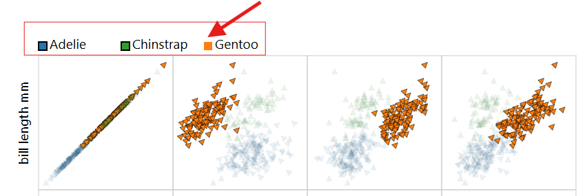
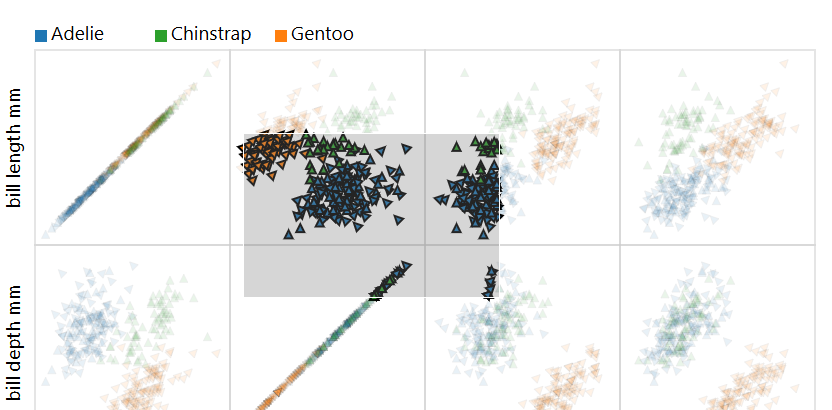

### Visualization design
1. **How many of each penguin species live on which of the three islands?**   
Based on the requirements in the task 1, we have two categorical features ( Islands, Species) along with one quantitative feature representing the total number of each species on each islands. This makes the heatmap graph appropriate for visualizing the data. 

2. **How can the three different penguin species be distinguished?**

    Based on the below **quantitative features** we can distinguish the penguins. 
- Bill_length_mm  
- Bill_depth_mm
- Flipper_length_mm
- Body_mass_g 
  
    This makes the scatter plot an appropriate choice for visualizing the data. 

3. Are the penguins' quantitative attributes dependent on the island?
- Yes, based on our insights the quatitative attributes of penguins are dependent on the Islands. Islands likely vary in food availability and species composition, driving these trait differences.

4. Do male and female penguins differ in their quantitative attributes? Is this difference the same for all species?
- Yes, the quantitative attributes are different between male and female.
- No, the amount of difference is not equal. Some species have bigger/lower difference than others.

### Interaction design
[describe which interactions are possible in terms of manipulating, faceting, and reducing the data and how they are triggered]
- For the task1, we have applied the aggregate interaction technique. we have indicate 6 different quantitative attributes levels for the each species on each island. We cut clutter and let pattern differences, based on species population across different island.
- For the task2, we have applied the superimposed interaction technique. we have combine different quantitative features into single plot.
- For the task3 & task4 constrain and select manipulation technique are used. 
    - **constrain:** make window by click and drag, that area would be in Focus
    - **selection:** click on the species color/name at the top of the Plot that those datapoints would be removed.

